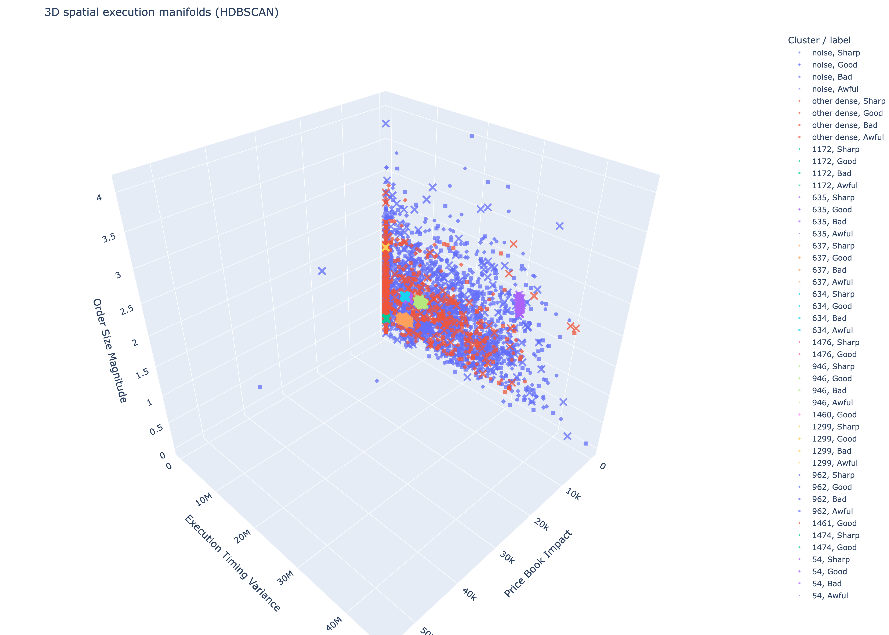
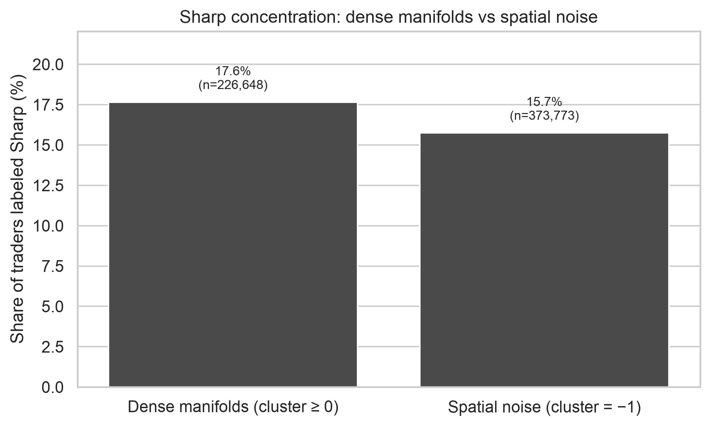
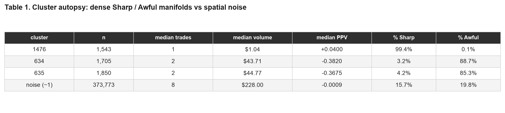

# Execution style clustering on Polymarket

I treated ~600k Polymarket traders as a 3D point cloud (like LiDAR, but for how people trade) and clustered them **without using profit**. The question was simple: do “sharp” traders clump together in space, and are “awful” traders more scattered?

**Short answer:** not really. Similar execution style is not the same as being good. The flashiest “99% sharp” cluster detected is about 1,500 people who each made **one trade of about $1**.

Interactive 3D viewer (full sample): [lilys7.github.io/polymarket-analysis/web](https://lilys7.github.io/polymarket-analysis/web/)



Each point is one trader. Color is the cluster; shape is the provided label (sharp / good / bad / awful). This plot is a downsample; the viewer above has the full 600k.

## What I put on the three axes

I did not cluster on PnL. I clustered on *how* someone trades:

- **X — book impact:** how many price levels their volume walks through
- **Y — time-of-day spread:** how spread out their trades are on the clock (`std_time_vw`, milliseconds inferred). This is not “speed”
- **Z — typical trade size:** `log10(mean_tx_value + 1)`, not total volume

Then I z-scored the three axes and ran [HDBSCAN](https://hdbscan.readthedocs.io/) (density clustering that is allowed to call points **noise** instead of forcing everyone into a group).

“Sharp” in this dataset is just a bin of profit per dollar (`trader_ppv = trader_pnl / trader_volume`). It is not a skill grade.

## What showed up

After cleaning: **604,578 -> 600,421** traders. HDBSCAN found **1,684** dense groups and labeled **62.3%** of traders as noise (`cluster = -1`). Noise here means “does not sit in a tight execution blob,” not “bad at trading.”

If structured execution were skill, my hypothesis was that "sharp" traders should pile into the dense groups. However, the results showed that they barely do:



17.6% of dense-cluster traders are labeled sharp vs 15.7% of noise. About a 2 pp gap.

The 99% "sharp" ball (cluster **1476**) and the two ugly ones (**634**, **635**) look dramatic until you open trade count and volume:



Cluster 1476 has median **1 trade** and median volume **$1.04**. Time spread is 0 because the standard deviation of a single timestamp is 0. Note: that is not a TWAP bot.

Losers are not uniquely “scattered” either. 62.3% of *everyone* is noise, so 66.4% of awful+bad being in noise is only a small bump. "Sharps" sit in noise at the same rate as "awfuls" (both 59.5%).

One of the three axes barely moves: about **69%** of wallets have book impact exactly 0, so the cloud is mostly a pancake of time-spread × size.

## Takeaway

Repeating how someone trades (size, clock spread, book impact) is not the same as being a good trader. The 3D model is good at finding **style clones**. It does not detect edge.

A real alpha test would need trade-level timestamps so you could ask whether style in one period predicts profit in the next. This parquet is one row per trader for their whole history, so that test is not possible here.

## What’s in the repo

| Path | What it is |
|---|---|
| `src/data_loader.py` | load parquet, drop inf/NaN, log-transform size |
| `src/feature_engineering.py` | HHI (topic concentration) + z-scored 3D features |
| `src/spatial_model.py` | HDBSCAN (`min_cluster_size=50`, `min_samples=15`) |
| `src/visualize.py` | 3D plot + "sharp" vs noise bar |
| `src/web_export.py` | compact point cloud for the Three.js viewer |
| `notebooks/exploration.ipynb` | walkthrough + paper tables |
| `web/` | interactive viewer |
| `figures/` | pngs used above |

## Run it

Put the trader parquet at `data/data.parquet`, then:

```bash
pip install -r requirements.txt
# cluster + print results
python3 main.py          
# also write web/data for the viewer
python3 main.py --web    
```

HDBSCAN on 600k points takes about a minute. The notebook can skip a refit and attach saved cluster ids from `web/data/points.bin` if you already exported once.

Open `web/index.html` locally, or the GitHub Pages link above.
